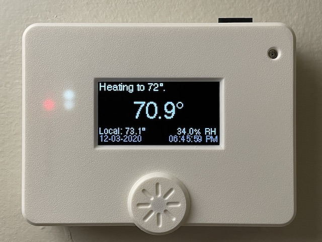

# kbx's Climate and Sprinkler Controller

This document is for folks who want a closer look at the design of the Climate and Sprinkler Controller electronics...or want to know why I did a thing the way I did the thing.

## Design Principals

I'll say it first: I did not design this to be an Ecobee or a Nest. Instead, it is intended to be a nod towards makers to help them get to where they want to be. As such, it is designed and intended to be:
 - Flexible
 - Expandable
 - Hackable

It is not:
 - Cost optimized
 - Electrically optimized
 - Designed to do one very-specific thing

While I think it would be very cool to mass-produce these and have them available on some site like [Tindie](https://www.tindie.com), I probably don't have the time or ambition right now to do that on my own -- and I also realize that these aren't really optimized for that purpose. For that to be really successful, I think many of the aspects I mentioned above would need to be trimmed out to simplify assembly and (consequently) reduce cost. On some level, I feel like that would defeat the purpose of the original design. Everybody always wants stuff to be cheaper but, to have really nice and easy-to-work-with things, it's really difficult to do that, at least on a small (in terms of production) scale.

## Hardware Overview

There are five key components:
 - Power supply
 - Processor (ESP32)
 - Sensors
 - Display
 - I/O Expander and switching hardware:
   - TRIACs, opto-isolators, snubber circuits
   - Relays, FETs, kick-back diodes

Let's dig in and take a closer look at each one.

### Power Supply

This is a buck converter based on the TI `LMR36520` step-down converter IC. The design (and, largely, physical layout on the PCB) came directly from TI's Webench app. As arranged here, it should be capable of providing up to two amps of current at five volts. **Two amps???** Yes, I did that -- it's overkill, I know. Perhaps someday I'll scale it back so as to eliminate the huge inductor that's a part of the converter. Still, in this configuration, it should be more than capable of powering any add-ons you might wish to attach to this board. You'll find that's a common theme here -- I've considered that anyone using this will want to "hack" it and make their own changes and/or additions. As such, the buck converter here is oversized so that you can play as you wish. :)

Before the buck converter there is also a bridge rectifier and (big) smoothing capacitor. Not much else to see here...move along, please.

### Processor

The ESP32 (module) is my go-to for these projects. They are an order of magnitude better than the ESP8266 in terms of available peripherals, memory and processing power. I strongly encourage anybody and everybody to use them in their projects, too -- they're far more flexible and just generally easier to use as a result.

### Sensors

I'm often asked "why so many sensors?" The answer is simple: Physically, they are tiny and the cost associated with placing the footprints onto the PCB for each of them is, at very most, negligible. In addition, given the current situation in 2021/2022 as it relates to parts shortages, having the extra footprints allows you to use _whatever you can get_ as opposed to being locked into a specific part. Because they all use the I2C bus, you can use as many or as few as you like. If you want to go the least-expensive route, just get the cheapest one you can. If you love data and cost isn't an issue, buy them all! If you can't get your first choice because of shortages, you can use your second choice until your preferred sensor arrives. Flexibility is pretty great, yeah?

In terms of why I picked the specific sensors I picked, it more or less comes down to that these are the most well-known, well-supported and easily available (at least, prior to 2021). There isn't really a technical reason for the selection -- temperature is really the only data point they _need_ to provide. If there is a different sensor you'd like to use, the break-out headers along the edges of the boards should make it easy for you to connect it, whether it's I2C, SPI, serial or some other protocol.

### Display

I picked the OLED displays because of their great contrast. Even though they're relatively low-resolution, I like how they look and they're pretty easy to use. I just really wish I could get a _color_ OLED display that's the physical dimensions of the [SSD1325](https://www.adafruit.com/product/2674) -- it would look sooo much cooler.

After I'd created the v2/v3 PCBs, naturally a few people came back and asked, "Why not a touchscreen?!?" This brought about the Nextion versions of these.

So. Let's talk about these Nextion displays for a moment. I'll just say it: I really do not love the Nextion platform. Their editor...works...but (in my opinion) it is a hot mess; there's no integration with source control so maintaining different versions of things and tracking changes is basically impossible. I hate that only a Windows version of the editor is available. Finally, the Nextion hardware itself...well, I guess it fills a gap, but...it's 2022...touchscreen hardware like this _should be_ sooooo much better. The "Intelligent" series is the only series that I feel like I can work with. Many of the UI elements they offer (slider controls, for example) are _terribly ugly_ and not something I would _ever_ use in a modern UI. (This is primarily why my UI has up/down arrows and not a slider!) Animations/effects are choppy (low FPS) even with few elements on the display. The overall experience feels worse than using a PC running Windows 3.11 from 1993. I don't expect them to work like an iPhone but..._come on._ Lots of improvements need to be made here. In any event, I'm excited to see a couple of other projects brewing that will bring about a more powerful and more customizable display experience. I'm excited to see what the future will bring!

### I/O Expander and Switching Hardware

These components are the parts that give the software physical control of the HVAC system or sprinkler valves (or whatever else you've connected to it). There are some technical reasons for their selection. I'll explain...

First, let's talk about the `MCP23017` I/O expander. The ESP32 arguably has enough GPIO pins...why use an I/O expander? There are multiple reasons:
 - The I/O expander's pins will retain their state when the ESP32 resets.
 - Several of the ESP32's GPIO pins get bumped into undesirable states when it resets.
 - The I/O expander frees up pins on the ESP32 for other uses (displays, sensors, other I/O, etc.).

For HVAC applications, it is _very important_ that control signals are stable, consistent and don't change states too quickly. Generally speaking, the `MCP23017` physically prevents this from happening because its pins are incapable of being in a state other than "on" or "off" (and by this I mean there aren't a bunch of on-board peripherals that can be (accidentally) mapped to pins, causing (for example) a PWM signal to appear on a pin. This could be disastrous to attached hardware/systems). Worst-case, the `MCP23017` has its own built-in auto-reset circuit that will force all of its pins into a safe "off" state, effectively disengaging any attached hardware. After the ESP32 resets, it will simply reinitialize the `MCP23017` and set its pins back into the desired/necessary state. So, in short, the `MCP23017` creates a physical barrier that provides a layer of protection against "dumb" things happening to any attached hardware.

Next up: TRIACs. Why use TRIACs? Quick answer: they're more reliable and have a longer lifespan than relays. Typically they are less expensive than relays, too. They're specifically designed for switching alternating current (AC) which happens to be what most HVAC systems use for their control signals. On the PCB, around the TRIACs you'll find an arrangement of resistors, capacitors and an opto-triac. These components simply allow the I/O expander to safely and reliably switch the TRIAC on and off as required.

What about the relays? I designed in relays because I had a couple of people bring up millivolt systems. The relays allow switching of things that the TRIACs can't handle. There are some (older?) gas heating systems that use no electrical power supply at all -- instead, a small current is "induced" by the heat differential created by a pilot flame and this millivolt signal is somehow sufficient to switch the rest of the system on or off. I'm not going to pretend to understand it right now (Google is your friend if you are curious) but a physical electrical contact is the only way to switch these systems. So, I added some relays, just to cover all the bases. :) A 2N7002 FET is responsible for switching each relay coil on/off and each FET is controlled by one of the I/O expander's GPIO pins.

## Wrapping Up

I think that covers the majority of what thoughts went into the hardware. If you find you have other questions about the hardware or software, please feel free to reach out! I'm happy to respond to questions or other inquiries.

## Legal stuff and License

Everything you see here is provided to you free of charge. You are free to use it however you please within the constraints of the license -- but you do so at your own risk. I accept absolutely no liability if you cause damage to your property, HVAC system, or any other hardware you choose to connect to this device.

The circuit schematics, PCBs and enclosures found here are licensed under the
 [Creative Commons Attribution-ShareAlike 4.0 International License](http://creativecommons.org/licenses/by-sa/4.0/).

_Happy building!_