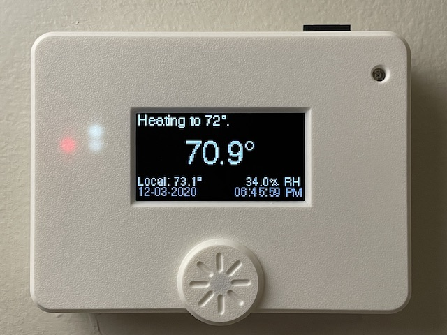

# kbx's Climate and Sprinkler Controller

## A DIY Thermostat and/or Sprinkler (Valve) Controller

Here you'll find plans for an ESP32-based controller designed with [ESPHome](https://esphome.io) in mind. It is primarily designed for switching 24-volt AC circuits but it is flexible by design and should be adaptable to other types of electrical workloads.

In the [Preface](PREFACE.md) you will find background information about this project such as how it came to be and some personal thoughts and experiences I've had with home automation through the years.

In the [Hardware](HARDWARE.md) document you will find a general explanation of the theory of operation of a thermostat as well as a design overview of this device, some handy tips (should you choose to build one), construction, usage, and installation detail.

Finally, the [Hardware Detail](HARDWARE_DETAIL.md) document aims to explain why I did what I did -- design decisions, etc.

## Design Versions

At present there are two major "versions" of (iterations on?) the device -- a version that supports an OLED display such as the [SSD1325](https://www.adafruit.com/product/2674) and a version (well, actually three versions) that supports a Nextion touchscreen display. The project files for each can be found in its respective directory:
 - OLED versions:
   - [Version 2 (WROOM)](WROOM/)
   - [Version 3 (WROVER)](WROVER/)
 - Nextion versions:
   - [Nextion 3.5"](WROVER-Nextion3.5/) (contains no switching hardware!)
   - [Nextion 5"](WROVER-Nextion5/)
   - [Nextion 7"](WROVER-Nextion7/)

## PCB and BoMs

The schematic and PCB were drawn in [KiCAD](https://www.kicad.org). I had PCBs fabricated by [Elecrow](https://www.elecrow.com) but nearly any PCB fabricator should be able to manufacture these without any issues.

On [Octopart](https://octopart.com) I have posted a bill of materials (BoM) for each design version:
 - OLED versions:
   - [Version 2 (WROOM)](https://octopart.com/bom-tool/XvGbAePy)
   - [Version 3 (WROVER)](https://octopart.com/bom-tool/vZKpLnMD)
 - Nextion versions:
   - [Nextion 3.5"](https://octopart.com/bom-tool/dj6BW0gV) (contains no switching hardware!)
   - [Nextion 5"](https://octopart.com/bom-tool/kHZhyfjO)
   - [Nextion 7"](https://octopart.com/bom-tool/b5Lb00Zs)

### Important!

**Save money** by reading through the [build guide](HARDWARE.md) **before** you order any parts, as you likely _do not need **every** part in the linked BoMs!_ (For example, there are footprints multiple sensors on each PCB. You do not need all of the sensors!)

## ESPHome Configuration & Code

I've created a separate repository for my [ESPHome](https://esphome.io) [configurations](https://github.com/kbx81/esphome-configs); if you're looking for a starting point/example configuration, please have a look there.

## Legal stuff and License

Everything you see here is provided to you free of charge. You are free to use it however you please within the constraints of the license -- but you do so at your own risk. I accept absolutely no liability if you cause damage to your property, HVAC system, or any other hardware you choose to connect to this device.

The circuit schematics, PCBs and enclosures found here are licensed under the [Creative Commons Attribution-ShareAlike 4.0 International License](http://creativecommons.org/licenses/by-sa/4.0/).

_Thanks for visiting!_